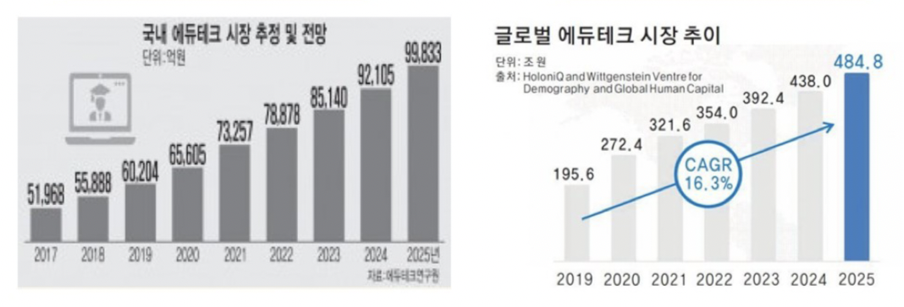
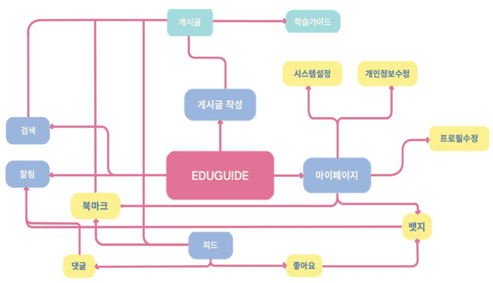
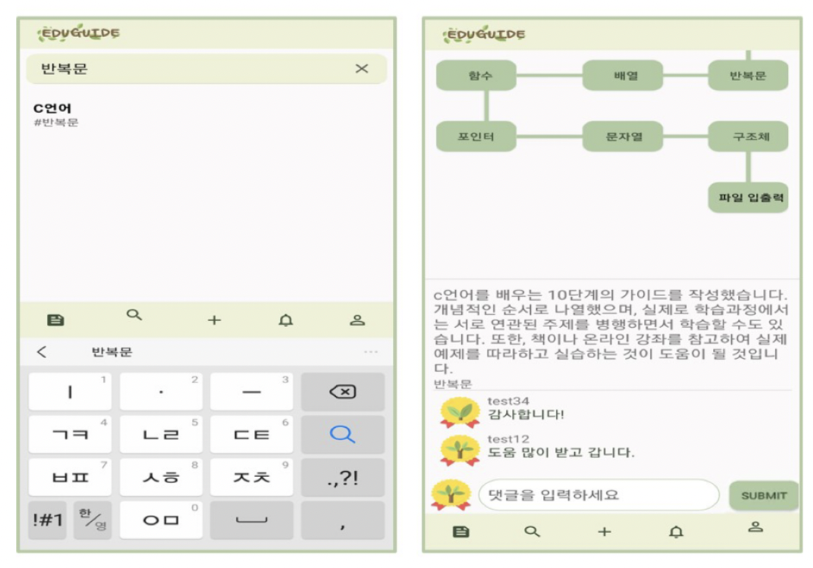
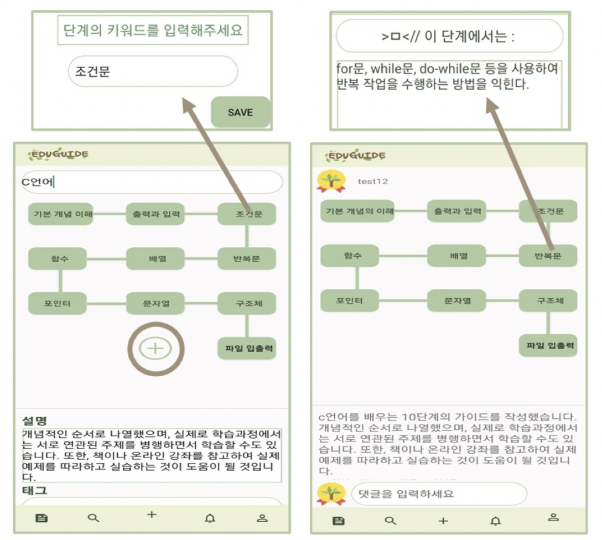

# EDUGUIDE
안드로이드 학습 계획 도구 및 커뮤니티 애플리케이션

 ## 개발 목적
- 학습 커리큘럼의 시각화를 통한 학습 관리 계획 + 사용자 간의 학습 계획 피드백을 위한 커뮤니티 기능

- 코로나19로 인한 교육 형태의 변화
- 자기주도 학습 능력의 필요성 강화
- 학습 계획 도구와 커뮤니티를 동시에 제공하는 소프트웨어의 부재

## 요구 분석

- 주요 기능 : 게시글 작성, 검색, 피드, 알림, 마이페이지
- 세부 기능 : 댓글, 좋아요, 좋아요 수에 따른 뱃지 부여, 피드 북바크, 프로필 수정, 시스템 설정, 개인정보 수정

## 개발 내용
### 학습 가이드 작성 툴

### 검색 및 댓글 기능

### 좋아요 수에 따른 뱃지 부여

